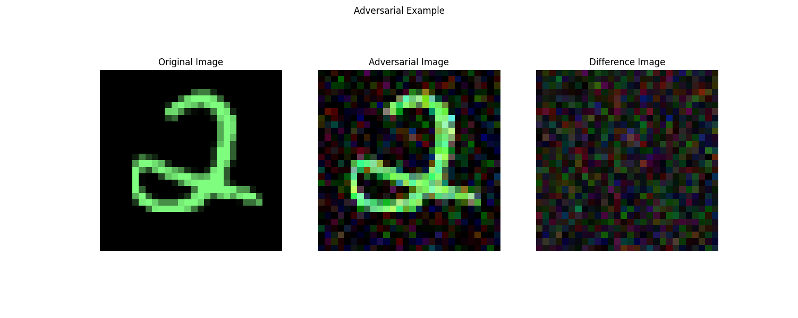
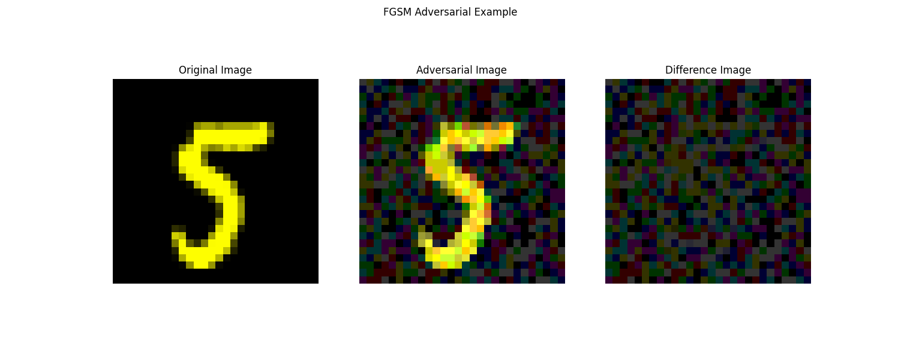
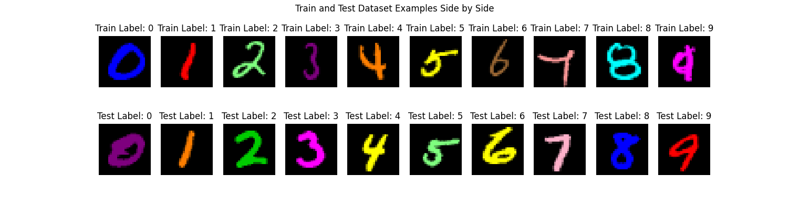

# **Distributionally Robust Colored MNIST**

This repository implements a **Distributionally Robust Optimization (DRO)** algorithm to enhance adversarial robustness, applying it to a custom **Colored MNIST dataset**. The project also evaluates its performance against the **Fast Gradient Sign Method (FGSM)** and **standard training (no adversarial defense).**

## **Table of Contents**
1. [Project Overview](#project-overview)
2. [Core Features](#core-features)
3. [Key Functions](#key-functions)
4. [Visualizations](#visualizations)

---

## **1. Project Overview**

Deep learning models are often vulnerable to adversarial attacks or spurious correlations. This project tackles this challenge by:
- Implementing **DRO training**, inspired by [*Certifying Some Distributional Robustness with Principled Adversarial Training*](https://arxiv.org/abs/1710.10571) by Sinha et al.
- Applying DRO on a **Colored MNIST dataset**, where colors are spuriously correlated with digit labels.
- Offering tools to compare **DRO**, **FGSM adversarial training**, and **standard training**.

---

## **2. Core Features**

- **Custom Dataset**: Creates a Colored MNIST dataset with spurious correlations provided color palettes for the test and training set.
- **DRO Training**: Implements a distributionally robust training algorithm to defend against adversarial perturbations.
- **FGSM Adversarial Training**: Implements FGSM to test its robustness against adversarial attacks.
- **Standard Training**: Provides a baseline without adversarial defenses.
- **Visualization Tools**: Includes functions for visualizing adversarial examples and dataset characteristics.

---

## **3. Key Functions**

### 1. `run_experiments`
- **Purpose**: Runs the **Distributionally Robust Optimization (DRO)** training algorithm on the Colored MNIST dataset.
- **Details**:
  - Executes the training process **three times for each parameter combination** to account for randomness in the model initialization.
  - For each parameter combination, a dedicated folder is created where all important data (e.g., model checkpoints, logs, and results) related to the training is saved.
- **Output**: Trained models using DRO, saved data for each training run, and performance metrics for analysis.

### 2. `visualize_adversarial_example`
- **Purpose**: Visualizes **adversarial examples** generated using a model trained with DRO.
- **Details**:
  - Displays the original image, the adversarially perturbed image, and the difference between them.
  - Useful for understanding the effect of adversarial perturbations on models trained with DRO.
- **Output**: Visualization of adversarial examples.

### 3. `visualize_color_palettes`
- **Purpose**: Visualizes the **color palettes** used in the training and testing datasets.
- **Details**:
  - Provides a side-by-side comparison of the colors assigned to digit labels in the training and test datasets.
- **Output**: A visualization showing how spurious correlations are introduced through color labeling.

### 4. `run_fgsm_experiments`
- **Purpose**: Runs the **Fast Gradient Sign Method (FGSM)** adversarial training algorithm on the Colored MNIST dataset.
- **Details**:
  - Executes FGSM training **three times for each parameter combination** to account for randomness in initialization.
  - Creates a folder for each parameter combination to store important data, including model checkpoints and training logs.
- **Output**: Trained models using FGSM, saved data for each training run, and performance metrics for analysis.

### 5. `visualize_fgsm_adversarial_example`
- **Purpose**: Visualizes **adversarial examples** generated using a model trained with FGSM.
- **Details**:
  - Displays the original image, the adversarially perturbed image, and the difference between them.
  - Useful for comparing the effects of adversarial training on the model's robustness.
- **Output**: Visualization of adversarial examples.

### 6. `run_standard_experiments`
- **Purpose**: Runs the **standard training** algorithm (without adversarial defense) on the Colored MNIST dataset.
- **Details**:
  - Executes standard training **three times for each parameter combination** to account for randomness in initialization.
  - Creates a folder for each parameter combination to store important data, including model checkpoints and training logs.
- **Output**: Trained models without adversarial defenses, saved data for each training run, and performance metrics for analysis.

---

## **4. Visualizations**

### **Adversarial Example: DRO**
This image visualizes an adversarial example generated using the **Distributionally Robust Optimization (DRO)** training algorithm. Similar to FGSM, it displays the original image, the adversarially perturbed image, and the difference between the two.

#### Parameters:
- `gamma = 0.3`
- `learning_rate_adversarial = 0.1`
- `epsilon = 0.0001`
- `loss_fn_adversarial = nll_loss`
- `adversarial_variance = 0.2`
- `max_steps = 100`



---

### **Adversarial Example: FGSM**
The following image demonstrates the effect of the **Fast Gradient Sign Method (FGSM)** on the Colored MNIST dataset. The original image, the adversarially perturbed image, and the difference between the two are shown side-by-side.

#### Parameters:
- `epsilon = 0.2`



---

### **Colored MNIST Dataset Visualization**
Below is a visualization of a possible training and testing dataset. Colors are spuriously correlated with digit labels to introduce a challenging dataset for robustness evaluation. Users can specify custom **color palettes** for both the training and test datasets, allowing flexibility in how spurious correlations are introduced.

#### Default Color Palettes:
- **Color Palettes**:
  ```python
  train_color_palette = [
      [0.0, 0.0, 1.0], [1.0, 0.0, 0.0], [0.5, 1.0, 0.5], 
      [0.5, 0.0, 0.5], [1.0, 0.5, 0.0], [1.0, 1.0, 0.0], 
      [0.6, 0.4, 0.2], [1.0, 0.6, 0.6], [0.0, 1.0, 1.0], 
      [1.0, 0.0, 1.0]
  ]
  test_color_palette = [
      [0.5, 0.0, 0.5], [1.0, 0.5, 0.0], [0.0, 0.8, 0.0], 
      [1.0, 0.0, 1.0], [1.0, 1.0, 0.0], [0.5, 1.0, 0.5], 
      [1.0, 1.0, 0.0], [1.0, 0.7, 0.8], [0.0, 0.0, 1.0], 
      [1.0, 0.0, 0.0]
  ]



